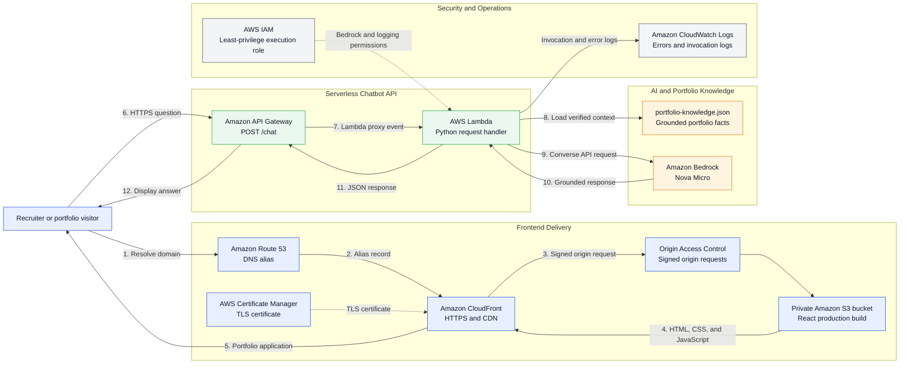

# Cloud Portfolio with Serverless AI Assistant

A cloud engineering and data engineering portfolio built with React and deployed on
AWS. The site includes a serverless AI assistant that answers recruiter-focused
questions about Atnafu Ayalew's projects, AWS experience, technical skills,
certifications, and contact information.

**Live site:** [https://atnafuayalew.com](https://atnafuayalew.com)

## Project Overview

This project combines static website hosting, global content delivery, serverless API
development, and generative AI integration in one production portfolio.

The React frontend is built with Vite and hosted in Amazon S3. Amazon CloudFront serves
the site globally over HTTPS, while Route 53 and AWS Certificate Manager provide the
custom domain and TLS certificate.

The AI assistant sends questions through Amazon API Gateway to AWS Lambda. Lambda
validates each request, loads structured portfolio information, applies response rules,
and invokes Amazon Nova Micro through Amazon Bedrock. The assistant is grounded in
documented portfolio facts and is instructed not to invent experience, credentials, or
project results.

## Architecture



The diagram contains two request paths. Steps 1-5 deliver the React application through
Route 53, CloudFront, and the private S3 origin. Steps 6-12 process a chatbot question
through API Gateway, Lambda, the structured portfolio knowledge, and Amazon Bedrock.

## How the AWS Infrastructure Was Created

The repository currently contains the application and Lambda source code, but it does
not contain Terraform, CDK, SAM, or CloudFormation templates for this portfolio. The
AWS resources were configured through the AWS Management Console, and repeat
application deployments are performed with the AWS CLI.

The infrastructure is created in the following order.

### 1. Configure the domain and TLS certificate

1. Create or use the Route 53 hosted zone for `atnafuayalew.com`.
2. In AWS Certificate Manager in `us-east-1`, request a public certificate for
   `atnafuayalew.com` and, when used, `www.atnafuayalew.com`.
3. Select DNS validation and add the ACM validation records to Route 53.
4. Wait until ACM reports the certificate status as **Issued**.

CloudFront requires its ACM viewer certificate to be in `us-east-1`, even when the S3
bucket is in another Region. See the AWS documentation for
[CloudFront certificate requirements](https://docs.aws.amazon.com/AmazonCloudFront/latest/DeveloperGuide/cnames-and-https-requirements.html).

### 2. Create the private S3 frontend bucket

1. Create an S3 bucket for the production website files.
2. Enable **Block all public access**.
3. Keep Object Ownership set to **Bucket owner enforced**.
4. Upload the Vite production output from `dist/`, not the React source files.

The secure production design uses the regular S3 bucket origin with CloudFront Origin
Access Control (OAC). It does not require the bucket to be publicly readable or use the
S3 website endpoint.

### 3. Create CloudFront and Origin Access Control

1. Create a CloudFront distribution with the private S3 bucket as its origin.
2. Create an OAC for an S3 origin and use the recommended **Sign requests** setting.
3. Attach the OAC to the S3 origin.
4. Set `index.html` as the default root object.
5. Set the viewer protocol policy to **Redirect HTTP to HTTPS**.
6. Add `atnafuayalew.com` as an alternate domain name.
7. Attach the ACM certificate created in `us-east-1`.

The S3 bucket policy grants read access only to the CloudFront distribution:

```json
{
  "Version": "2012-10-17",
  "Statement": [
    {
      "Sid": "AllowCloudFrontReadOnly",
      "Effect": "Allow",
      "Principal": {
        "Service": "cloudfront.amazonaws.com"
      },
      "Action": "s3:GetObject",
      "Resource": "arn:aws:s3:::YOUR_BUCKET_NAME/*",
      "Condition": {
        "StringEquals": {
          "AWS:SourceArn": "arn:aws:cloudfront::YOUR_ACCOUNT_ID:distribution/YOUR_DISTRIBUTION_ID"
        }
      }
    }
  ]
}
```

OAC is the AWS-recommended method for restricting access to an S3 origin. See
[Restrict access to an Amazon S3 origin](https://docs.aws.amazon.com/AmazonCloudFront/latest/DeveloperGuide/private-content-restricting-access-to-s3.html).

### 4. Route the domain to CloudFront

After the distribution finishes deploying:

1. Create a Route 53 alias `A` record for `atnafuayalew.com`.
2. Select **Alias to CloudFront distribution** as the target.
3. Create an alias `AAAA` record as well when IPv6 is enabled.
4. Optionally redirect `www.atnafuayalew.com` to the primary domain.

At this point, the static portfolio is available through the custom HTTPS domain while
the S3 bucket remains private.

### 5. Configure Bedrock and the Lambda execution role

1. Confirm that Amazon Nova Micro is available in Amazon Bedrock in `us-east-1`.
2. Create an IAM execution role for the chatbot Lambda function.
3. Attach `AWSLambdaBasicExecutionRole` for CloudWatch Logs.
4. Add a least-privilege policy that allows `bedrock:InvokeModel` only for Nova Micro.

```json
{
  "Version": "2012-10-17",
  "Statement": [
    {
      "Effect": "Allow",
      "Action": "bedrock:InvokeModel",
      "Resource": "arn:aws:bedrock:us-east-1::foundation-model/amazon.nova-micro-v1:0"
    }
  ]
}
```

Amazon Bedrock foundation-model access is enabled by default when the account has the
required permissions. The Lambda role still needs explicit inference permission. See
[Amazon Bedrock model access](https://docs.aws.amazon.com/bedrock/latest/userguide/model-access.html).

### 6. Create the Lambda function

1. Create a Lambda function named `portfolio-chatbot` using Python 3.12.
2. Select the IAM execution role created in the previous step.
3. Set the handler to `lambda_function.lambda_handler`.
4. Configure 256 MB of memory and a 20-second timeout.
5. Add the following environment variables:

```text
BEDROCK_REGION=us-east-1
BEDROCK_MODEL_ID=amazon.nova-micro-v1:0
ALLOWED_ORIGIN=https://atnafuayalew.com
```

6. Upload a ZIP containing both `lambda_function.py` and
   `portfolio-knowledge.json` at the ZIP root.
7. Run a Lambda test event before connecting the public API.

The function validates the request, loads the structured knowledge file, invokes Nova
Micro through the Bedrock Converse API, and returns an API Gateway-compatible response.

### 7. Create the API Gateway endpoint

1. Create an API Gateway **HTTP API**.
2. Add the `portfolio-chatbot` Lambda function as an integration.
3. Create a `POST /chat` route.
4. Use the `$default` stage or deploy a named stage.
5. Configure CORS with:

```text
Allowed origin:  https://atnafuayalew.com
Allowed method:  POST
Allowed header:  Content-Type
```

6. Test the invoke URL with a JSON request before connecting the React frontend.

### 8. Connect and release the frontend

Add the API Gateway endpoint to the production Vite environment:

```env
VITE_CHATBOT_API_URL=https://YOUR_API_ID.execute-api.us-east-1.amazonaws.com/chat
```

Then run the production build, synchronize `dist/` to S3, and invalidate CloudFront.
The exact repeat-deployment commands are documented in
[Deploy the Frontend to S3](#deploy-the-frontend-to-s3).

## AWS Services

| Service | Purpose |
| --- | --- |
| Amazon S3 | Hosts the production React files |
| Amazon CloudFront | Provides HTTPS and global content delivery |
| Amazon Route 53 | Manages the custom domain |
| AWS Certificate Manager | Provides the TLS certificate |
| Amazon API Gateway | Exposes the chatbot HTTP endpoint |
| AWS Lambda | Validates requests and coordinates model inference |
| Amazon Bedrock | Generates responses with Amazon Nova Micro |
| AWS IAM | Restricts Lambda permissions to required AWS actions |

## Key Features

- Responsive portfolio with featured cloud and data projects
- Serverless, recruiter-focused AI assistant
- Structured knowledge source for portfolio-specific responses
- Guardrails that distinguish completed, designed, and in-progress work
- Local fallback answers when the chatbot API is unavailable
- Request validation, CORS handling, error responses, and input-length limits
- HTTPS delivery through a custom domain and CloudFront
- Local backend runner for end-to-end development

## What This Project Demonstrates

- AWS static website deployment and CDN configuration
- Serverless API design with API Gateway and Lambda
- Amazon Bedrock model integration using the Converse API
- Prompt design and grounded response generation
- IAM permissions and frontend-to-backend CORS configuration
- React application development and production builds with Vite
- AWS CLI deployment workflows and CloudFront cache invalidation
- Testing and troubleshooting across frontend, API, and AI components

## Technology Stack

**Frontend:** React, Vite, JavaScript, CSS

**Backend:** Python, AWS Lambda, Boto3, API Gateway

**AI:** Amazon Bedrock, Amazon Nova Micro, structured JSON knowledge

**Infrastructure:** S3, CloudFront, Route 53, ACM, IAM

**Development tools:** Git, GitHub, AWS CLI, ESLint

## Project Structure

```text
cloud-portfolio/
|-- public/
|   `-- resume/
|-- src/
|   |-- assets/
|   |-- components/
|   |   |-- Chatbot.jsx
|   |   `-- Chatbot.css
|   |-- App.jsx
|   |-- main.jsx
|   `-- portfolio-knowledge.json
|-- lambda/
|   `-- portfolio-chatbot/
|       |-- lambda_function.py
|       |-- local_server.py
|       |-- portfolio-knowledge.json
|       `-- requirements.txt
|-- scripts/
|   `-- generate_business_card.py
|-- package.json
`-- vite.config.js
```

The two `portfolio-knowledge.json` files serve different environments:

- `src/portfolio-knowledge.json` supplies browser fallback responses.
- `lambda/portfolio-chatbot/portfolio-knowledge.json` grounds Bedrock responses.

Keep both files synchronized whenever portfolio facts are updated.

## Local Development

### Prerequisites

- Node.js 20 or newer
- npm
- Python 3.12 or newer for the local chatbot backend
- AWS CLI credentials with permission to invoke the configured Bedrock model
- Amazon Nova Micro access in `us-east-1`

### Run the frontend

```bash
npm install
npm run dev
```

Without `VITE_CHATBOT_API_URL`, the interface uses local fallback responses from
`src/portfolio-knowledge.json`.

### Run the complete chatbot locally

Create and activate a Python environment:

```bash
python3 -m venv .venv
source .venv/bin/activate
python -m pip install -r lambda/portfolio-chatbot/requirements.txt
```

Start the local Lambda-compatible backend:

```bash
python lambda/portfolio-chatbot/local_server.py
```

In another terminal, start the frontend with the local API:

```bash
VITE_CHATBOT_API_URL=http://127.0.0.1:8000/chat npm run dev
```

Test the backend directly:

```bash
curl -X POST http://127.0.0.1:8000/chat \
  -H 'Content-Type: application/json' \
  -d '{"question":"What AWS experience does Atnafu have?"}'
```

## Environment Variables

### Frontend

| Variable | Description |
| --- | --- |
| `VITE_CHATBOT_API_URL` | API Gateway or local chatbot endpoint |

For a production build, create an ignored `.env.production` file:

```env
VITE_CHATBOT_API_URL=https://YOUR_API_ID.execute-api.us-east-1.amazonaws.com/chat
```

### Lambda and local backend

| Variable | Default | Description |
| --- | --- | --- |
| `BEDROCK_REGION` | `us-east-1` | Region used by the Bedrock Runtime client |
| `BEDROCK_MODEL_ID` | `amazon.nova-micro-v1:0` | Bedrock model identifier |
| `ALLOWED_ORIGIN` | `*` | Allowed browser origin; set this to the portfolio domain in production |
| `LOCAL_CHATBOT_HOST` | `127.0.0.1` | Local API bind address |
| `LOCAL_CHATBOT_PORT` | `8000` | Local API port |
| `AWS_PROFILE` | AWS SDK default | Optional local AWS CLI profile |

## Quality Checks

```bash
npm run lint
npm run build
```

Validate the chatbot knowledge files:

```bash
python3 -m json.tool src/portfolio-knowledge.json > /dev/null
python3 -m json.tool lambda/portfolio-chatbot/portfolio-knowledge.json > /dev/null
cmp src/portfolio-knowledge.json \
  lambda/portfolio-chatbot/portfolio-knowledge.json
```

## Deploy the Lambda Backend

Create a deployment package with both the handler and its knowledge file at the ZIP
root:

```bash
cd lambda/portfolio-chatbot
zip -j portfolio-chatbot.zip \
  lambda_function.py \
  portfolio-knowledge.json
```

Upload `portfolio-chatbot.zip` to the existing Lambda function. Use:

```text
Runtime: Python 3.12
Handler: lambda_function.lambda_handler
Architecture: x86_64
```

Recommended configuration:

```text
Memory: 256 MB
Timeout: 20 seconds
ALLOWED_ORIGIN: https://atnafuayalew.com
```

The Lambda execution role requires CloudWatch logging permissions and permission to
invoke Nova Micro:

```json
{
  "Version": "2012-10-17",
  "Statement": [
    {
      "Effect": "Allow",
      "Action": "bedrock:InvokeModel",
      "Resource": "arn:aws:bedrock:us-east-1::foundation-model/amazon.nova-micro-v1:0"
    }
  ]
}
```

Configure API Gateway with a `POST /chat` route connected to the Lambda function and
allow the production portfolio origin in its CORS settings.

## Deploy the Frontend to S3

Build the production site after configuring `VITE_CHATBOT_API_URL`:

```bash
npm run build
```

Upload versioned assets with long-term caching:

```bash
aws s3 sync dist/assets/ s3://YOUR_BUCKET/assets/ \
  --delete \
  --cache-control "public,max-age=31536000,immutable"
```

Upload the remaining files without long-term caching:

```bash
aws s3 sync dist/ s3://YOUR_BUCKET/ \
  --exclude "assets/*" \
  --delete \
  --cache-control "no-cache"
```

Invalidate CloudFront so visitors receive the new build:

```bash
aws cloudfront create-invalidation \
  --distribution-id YOUR_DISTRIBUTION_ID \
  --paths "/*"
```

## Security and Accuracy

- The frontend contains no AWS credentials.
- Bedrock access is granted to the Lambda execution role through IAM.
- Requests are validated before model invocation and limited to 1,000 characters.
- The production CORS origin should be restricted to `https://atnafuayalew.com`.
- The model is instructed to use portfolio knowledge as its only factual source.
- Project and certification statuses are stored explicitly to reduce unsupported claims.
- Portfolio facts should be reviewed before every deployment.

## Contact

**Atnafu Ayalew**

Cloud Engineer | Data Engineer

- Portfolio: [atnafuayalew.com](https://atnafuayalew.com)
- GitHub: [github.com/atnafb](https://github.com/atnafb)
- LinkedIn: [linkedin.com/in/atnafuayalew](https://www.linkedin.com/in/atnafuayalew/)
